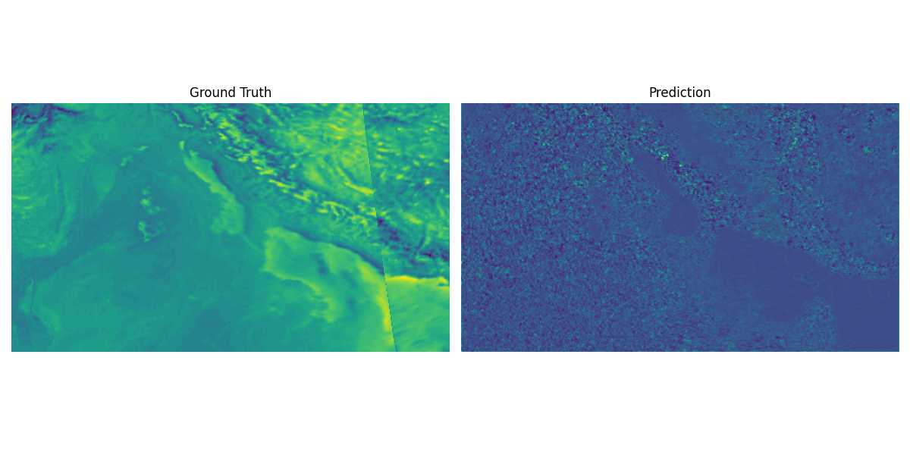

# Smogseer: A Convolutional LSTM model for forecasting air quality from Sentinel-5P data

<div align="center">
  
</div>

>Model workflow source code is avaiable in a private repository and can be shared upon request @ [tq89iwow@studserv.uni-leipzig.de](mailto:tq89iwow@studserv.uni-leipzig.de)

## Overview

Codebase for the Smogseer project, a convolutional LSTM network for forecasting air quality metrics from Sentinel-5P data.

Convolutional LSTM is a deep learning model that combines a convolutional neural network (CNN) and a long short-term memory (LSTM) network to account for bot, spatial and temporal autocorelation. The model is designed to predict air quality metrics from Sentinel-5P data, which is a satellite-based remote sensing dataset that provides real-time information on atmospheric composition.

The codebase includes scripts for data preprocessing, model training, and model evaluation. The data script downloads Sentinel-5P data, preprocesses it, and saves it in a format that can be used for training the model. The model training script trains the convolutional LSTM model on the preprocessed data and saves the trained model weights. The training script also evaluates the performance of the trained model on a test dataset and generates performance metrics.

The codebase also includes code and data that demonstrates how to use the model for making predictions on new data. The notebook reads the Sentinel-5P data, preprocesses it, loads the trained model, and makes predictions on the new data.


## Attribution

* Contact Taimur Khan -- [tq89iwow@studserv.uni-leipzig.de](mailto:tq89iwow@studserv.uni-leipzig.de)
* Please cite this work as:

```bibtex
@article{Khan2024,
  title={Smogseer: A Convolutional LSTM model for forecasting air quality from Sentinel-5P data},
  author={Khan, Taimur},
  journal={git.sc.uni-leipzig.de},
  year={2024},
  url={https://git.sc.uni-leipzig.de/ss2024-12-geo-m-ds02/smogseer/}
```
